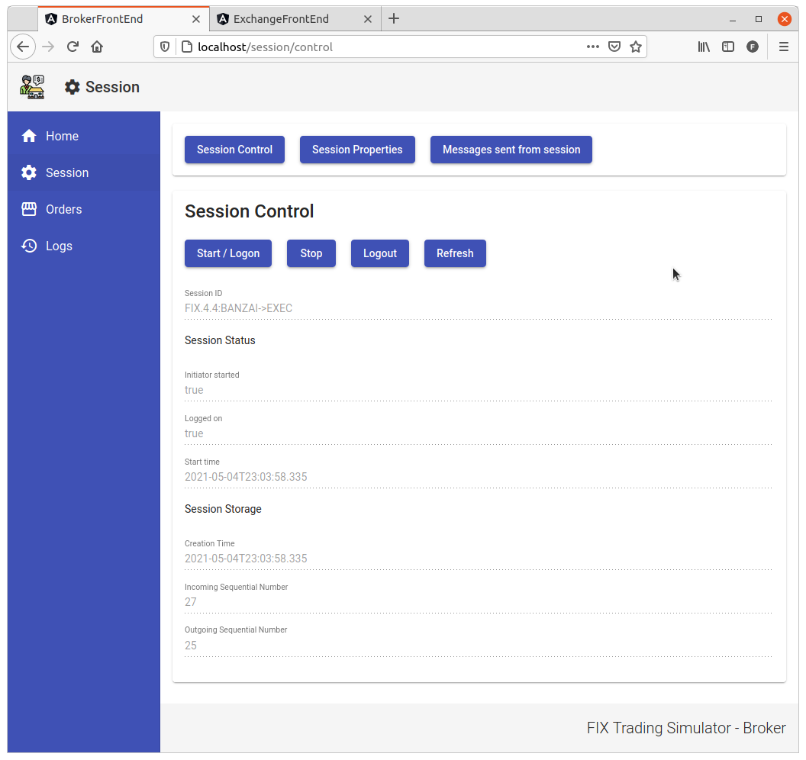
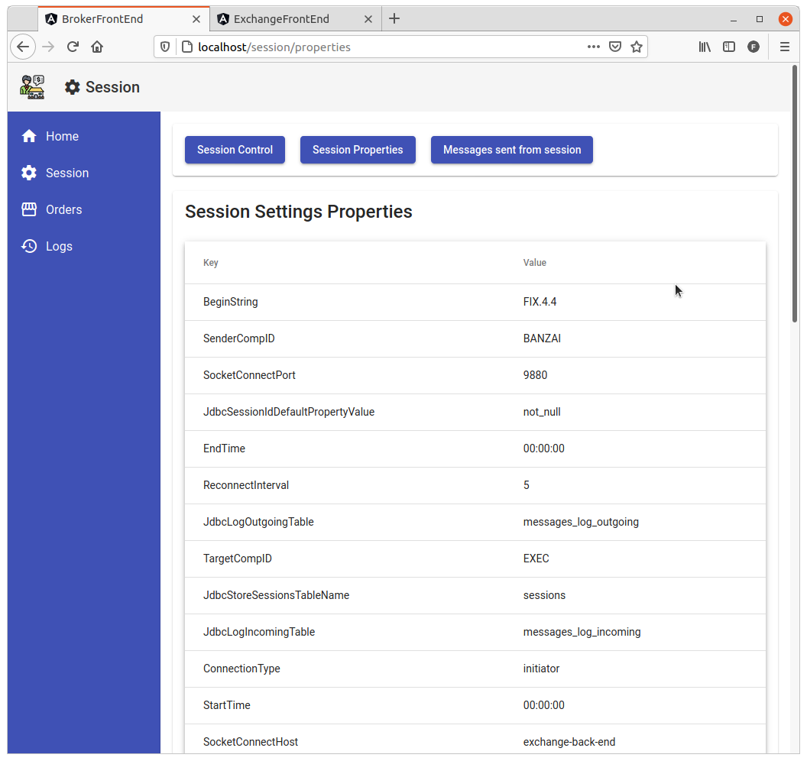
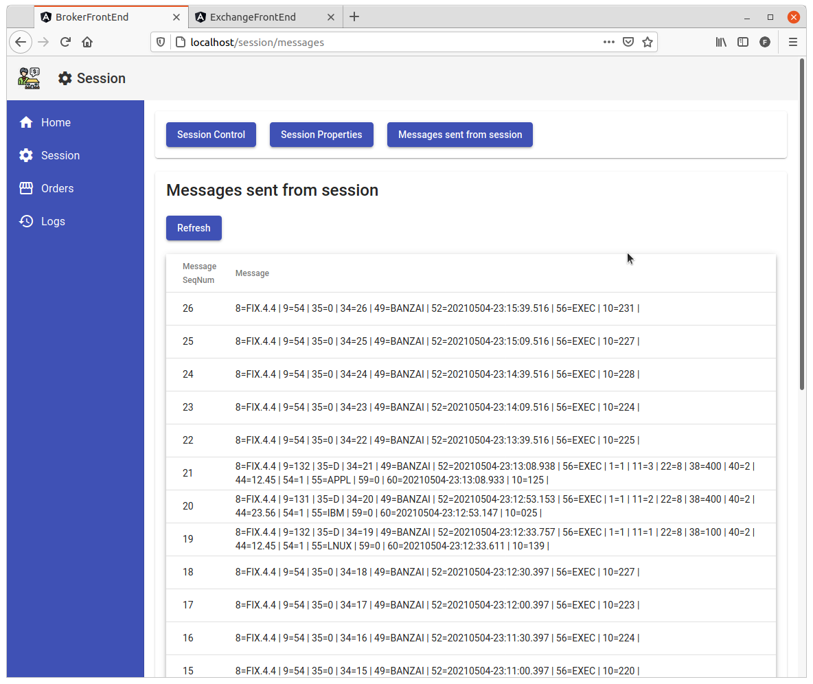
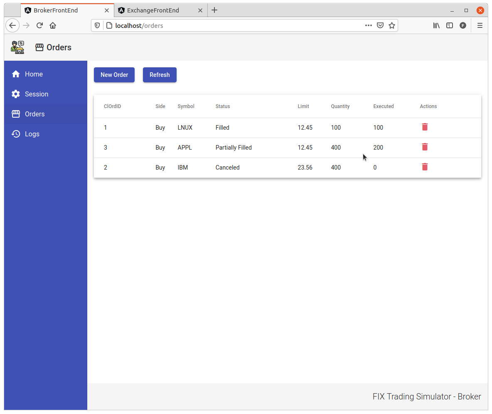
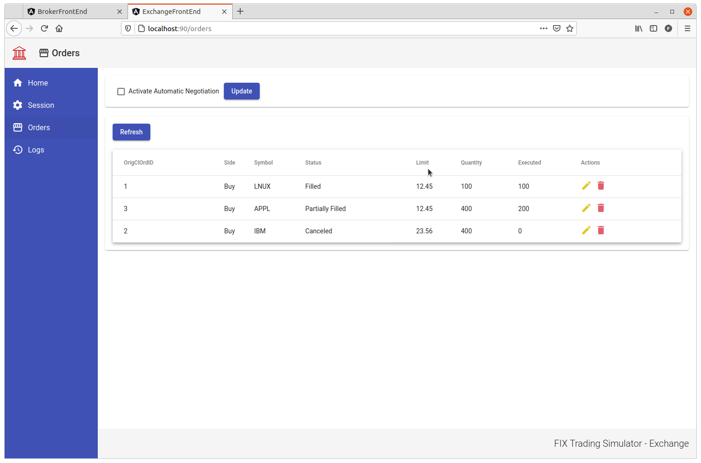
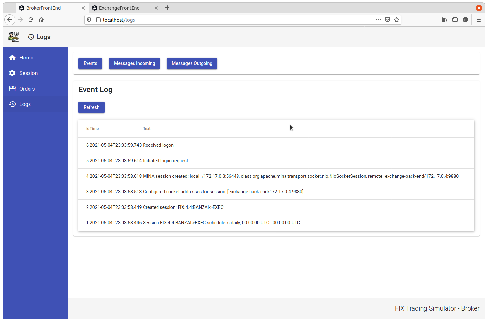
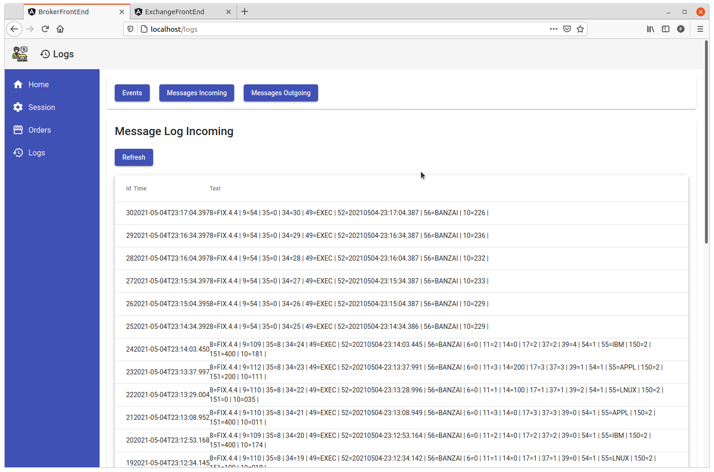

# Fix Trading Simulator

- [Overview](#overview)
- [Project Structure](#project-structure)
- [Features](#features)
- [Running the project](#running-the-project)
- [Images](#images)
- [Help Queries](#help-queries)


# Overview

A trading simulator between a Broker and a Stock Exchange using the [Financial Information eXchange (FIX) Protocol](https://www.fixtrading.org/). It's a study project using [QuickFIX/J](https://www.quickfixj.org/), [Quarkus](https://quarkus.io/), [Angular](https://angular.io/) and [PostgreSQL](https://www.postgresql.org/).

Both Broker and Exchange systems were built with Quarkus to the back-end and Angular to the front-end. The back-ends communicate each other with QuickFIX/J and each has a schema into the PostgreSQL.

System architecture:
- Stock exchange:
  - Back-end - Quarkus + QuickFIX/J;
  - Front-end - Angular;
- Broker:
  - Back-end - Quarkus + QuickFIX/J;
  - Front-end - Angular;
- PostgreSQL
  - One schema for each back-end.


# Project Structure

[Broker back-end](./broker-back-end/README.md)

[Broker front-end](./broker-front-end/README.md)

[Exchange back-end](./exchange-back-end/README.md)

[Exchange front-end](./exchange-front-end/README.md)

[Documentation](./documentation/README.md)

# Features

## Orders

You can submit, cancel and list your orders.

It's possible to set the Exchange to automatically negotiate the orders.

## Session

Make logon and logout.

View the session status and storage.

View the session configuration.

List the messages sent from the session.

## Logs

List the FIX events.

List the messages received and sent.


# Running the project

## With docker-compose

After start, access project at:
- Broker Front end
  - http://localhost/
- Broker Back end swagger: 
  - http://localhost:8080/q/swagger-ui/
- Exchange Front end
  - http://localhost:90/
- Exchange Back end swagger: 
  - http://localhost:8090/q/swagger-ui/
- PostgreSQL:
  - jdbc:postgresql://localhost:5432/postgres
  - user: postgres
  - password: postgres

The containers should be running like this:
```
docker ps
CONTAINER ID        IMAGE                               COMMAND                  CREATED             STATUS              PORTS                    NAMES
8191a0fcde2f        felipewind/exchange-front-end:1.0   "/docker-entrypoint.…"   16 minutes ago      Up 16 minutes       0.0.0.0:90->80/tcp       exchange-front-end
1178d4e1c02f        felipewind/broker-front-end:1.0     "/docker-entrypoint.…"   16 minutes ago      Up 16 minutes       0.0.0.0:80->80/tcp       broker-front-end
2370c47d0a2d        felipewind/broker-back-end:1.0      "/deployments/run-ja…"   16 minutes ago      Up 16 minutes       0.0.0.0:8080->8080/tcp   broker-back-end
8106b9a48217        felipewind/exchange-back-end:1.0    "/deployments/run-ja…"   16 minutes ago      Up 16 minutes       0.0.0.0:8090->8090/tcp   exchange-back-end
6b53a07b72ac        postgres                            "docker-entrypoint.s…"   16 minutes ago      Up 16 minutes       0.0.0.0:5432->5432/tcp   fix-trading-simulator_postgresql-qfj_1
```

### Using the Docker Hub Images

Inside the root folder of the project, execute:
```
$ chmod +x ./run-from-docker-hub.sh
$ ./run-from-docker-hub.sh
```

### Building the Docker images locally

Inside the root folder of the project, execute:
```
$ chmod +x ./run-with-local-build.sh
$ ./run-with-local-build.sh
```

After the first build, you can use the `run-after-local-build` script.


## Without docker-compose 

The default version of the back-end projects is using H2 data base (in memory).

It's possible to change the `application.properties` and set them to run with PostgreSQL, in this case you should start a PostgreSQL container:
```
docker run -d --name postgres-qfj -p 5432:5432 -e POSTGRES_USER=postgres -e POSTGRES_PASSWORD=postgres -e POSTGRES_DB=postgres postgres
```


### Enter inside the `exchange-back-end` folder and type:
```
$ ./mvnw compile quarkus:dev -Ddebug=5006
```

Access http://localhost:8090/q/swagger-ui/

### Enter inside the `broker-back-end` folder and type:
```
$ ./mvnw compile quarkus:dev
```

Access http://localhost:8080/q/swagger-ui/


### Enter inside the `exchange-front-end` folder and type:
```
$ npm install
$ ng serve
```

Access http://localhost:4300


### Enter inside the `exchange-back-end` folder and type:
```
$ npm install
$ ng serve
```

Access http://localhost:4200


# Images

## Session Control



## Session Properties



## Session Messages



## Orders list

### Broker



### Exchange



## Logs - FIX Events



## Logs - Messages incoming




# Help Queries


```sql
select * from broker.sessions;
select * from broker.messages;
select * from broker.event_log  order by id desc;
select * from broker.messages_log_incoming order by id desc;
select * from broker.messages_log_outgoing order by id desc;

select * from exchange.sessions;
select * from exchange.messages;
select * from exchange.event_log  order by id desc;
select * from exchange.messages_log_incoming order by id desc;
select * from exchange.messages_log_outgoing order by id desc;
```

